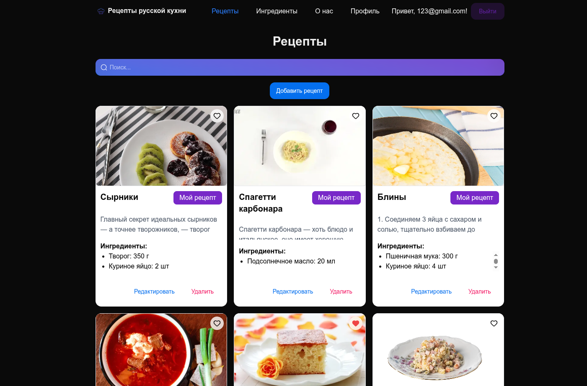
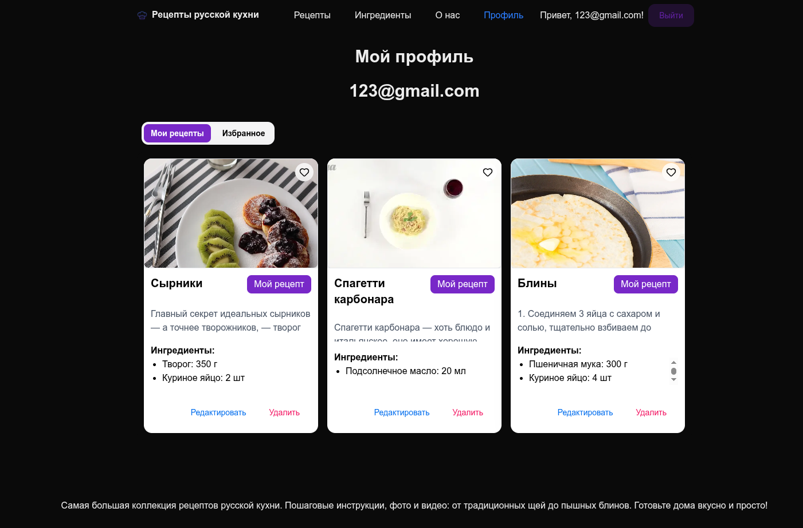
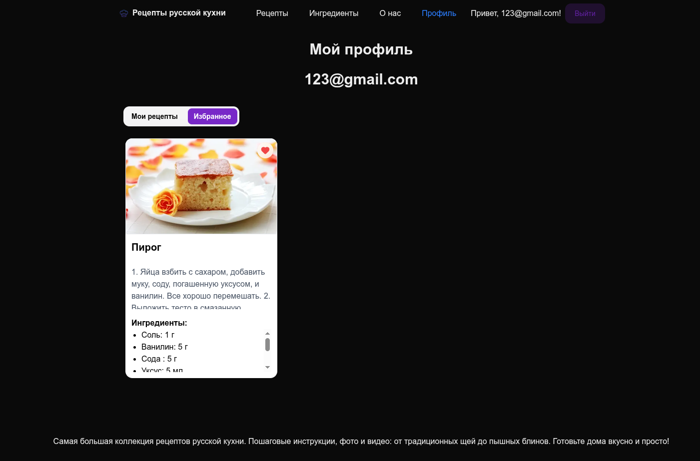
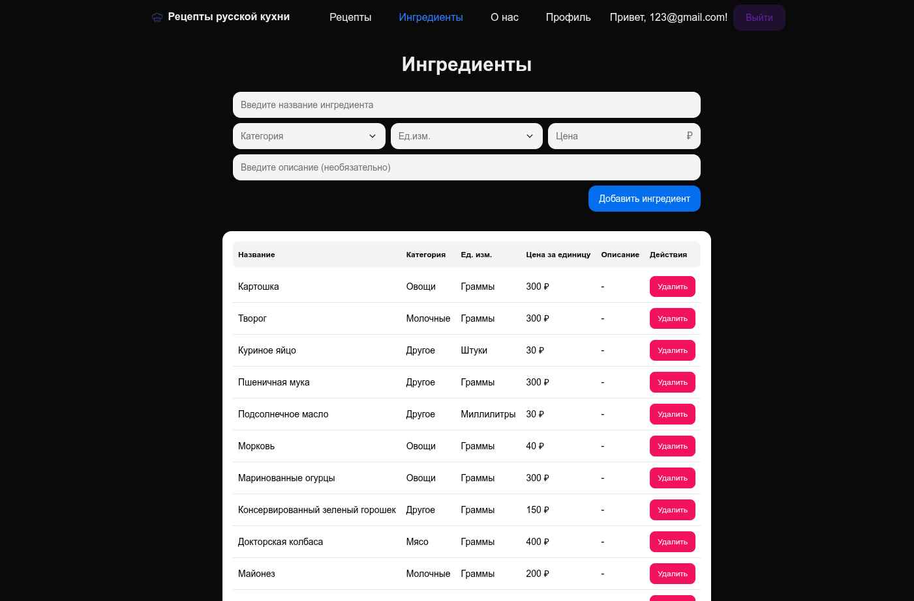

# Recipes Portal

Современное full-stack веб-приложение для поиска, хранения и управления рецептами русской кухни.

Проект разработан с использованием **Next.js 15**, **React 19** и **TypeScript**. Основной целью было изучение современных инструментов разработки, построение масштабируемой архитектуры и реализация полноценного CRUD-приложения с авторизацией, системой избранного и управлением связанными сущностями.

---

# Демонстрация

<p align="center">
  
</p>

---

# Скриншоты

| Главная              |
| -------------------- |
|  |

| Личный кабинет/ Мои рецепты | Личный кабинет/ Избранное |
| --------------------------- | ------------------------- |
|      |  |

| Управление ингредиентами    |
| --------------------------- |
|  |

---

# Возможности

## Аутентификация

- Регистрация пользователей
- Авторизация через NextAuth
- JWT-аутентификация
- Защищенные маршруты
- Личный кабинет пользователя

---

## Управление рецептами

- Просмотр каталога рецептов
- Поиск рецептов
- Просмотр подробной информации
- Создание новых рецептов
- Редактирование собственных рецептов
- Удаление рецептов

---

## Управление ингредиентами

Для авторизованных пользователей доступен отдельный раздел **«Ингредиенты»**.

Функциональность:

- просмотр списка ингредиентов;
- добавление новых ингредиентов;
- удаление существующих ингредиентов.

Все ингредиенты хранятся в отдельной таблице базы данных и используются повторно при создании и редактировании рецептов.

Такой подход позволяет избежать дублирования данных и обеспечивает единый справочник ингредиентов для всех пользователей.

---

## Избранное

- Добавление рецептов в избранное
- Удаление рецептов из избранного
- Просмотр списка избранных рецептов

---

## Профиль пользователя

- Просмотр информации о пользователе
- Просмотр собственных рецептов
- Управление созданными рецептами

---

# Особенности реализации

В проекте реализовано разделение данных на независимые сущности.

Основные сущности:

- User
- Recipe
- Ingredient
- Favorite

Ингредиенты представлены как самостоятельная сущность:

- хранятся в отдельной таблице базы данных;
- доступны для управления через отдельный интерфейс;
- используются повторно при создании рецептов;
- позволяют поддерживать целостность данных.

---

# Технологический стек

## Frontend

- Next.js 15
- React 19
- TypeScript
- Tailwind CSS 4
- HeroUI
- Framer Motion
- Zustand

## Backend

- Next.js API Routes
- Prisma ORM
- PostgreSQL
- NextAuth

## Работа с формами

- React Hook Form
- Zod

---

# Структура проекта

```
src
│
├── app
│   ├── (protected)
│   ├── (public)
│   ├── api
│   ├── layout.tsx
│   ├── error
│   └── not-found.tsx
│
├── auth
├── components
├── config
├── constants
├── forms
├── hoc
├── providers
├── schema
├── store
├── types
└── utils
```

---

# Основной функционал

| Возможность       | Описание                                                   |
| ----------------- | ---------------------------------------------------------- |
| Авторизация       | Регистрация и вход через NextAuth                          |
| CRUD рецептов     | Создание, просмотр, редактирование и удаление рецептов     |
| CRUD ингредиентов | Управление общим справочником ингредиентов                 |
| Избранное         | Добавление и удаление рецептов из избранного               |
| Профиль           | Просмотр данных пользователя и управление своими рецептами |
| Поиск             | Поиск рецептов по названию                                 |

---

# Локальный запуск

Клонировать репозиторий:

```bash
git clone https://github.com/Shapovalova-aal/recipes.git
```

Перейти в папку проекта:

```bash
cd recipes
```

Установить зависимости:

```bash
npm install
```

Создать файл `.env` и заполнить необходимые переменные окружения.

Запустить проект:

```bash
npm run dev
```

Приложение будет доступно по адресу:

```
http://localhost:3000
```

---

# Что было реализовано

- Авторизация через NextAuth
- JWT-аутентификация
- CRUD рецептов
- CRUD ингредиентов
- Система избранного
- Поиск рецептов
- Защищенные маршруты
- Работа с PostgreSQL через Prisma
- Валидация данных с помощью Zod
- Глобальное состояние через Zustand
- Адаптивная верстка
- Современный интерфейс на HeroUI

---

# Архитектурные решения

При разработке проекта особое внимание было уделено масштабируемости и переиспользуемости кода.

Основные принципы:

- разделение приложения на публичную и защищенную части;
- переиспользуемые UI-компоненты;
- выделение бизнес-логики в отдельные сервисы и хуки;
- использование Zustand для управления глобальным состоянием;
- типизация всех сущностей с помощью TypeScript;
- серверная работа с базой данных через Prisma ORM;
- валидация пользовательских данных с помощью React Hook Form и Zod.

---

# Автор

**Александра Шаповалова**

Frontend Developer

GitHub: https://github.com/Shapovalova-aal
